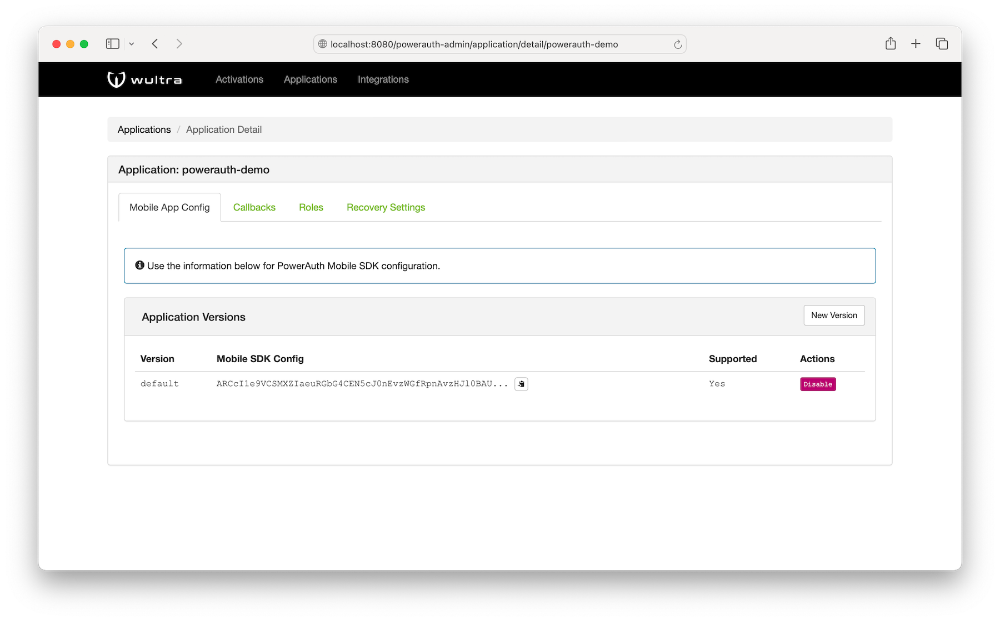

# PowerAuth Command-Line Tool Usage

This brief document serves as a documentation of the reference PowerAuth Client - a simple utility connecting to the standard RESTful API. The utility simulates a mobile device on desktop - you can use it for simple integration testing.

## Download PowerAuth Reference Client

You can download the latest `powerauth-java-cmd.jar` at the releases page:

- https://github.com/wultra/powerauth-cmd-tool/releases

## Installing Bouncy Castle

Before you can run the utility from the command-line, you need to register [Bouncy Castle](https://www.bouncycastle.org/) JCE provider in your JRE.

Please follow our [Bouncy Castle installation tutorial](https://github.com/wultra/powerauth-server/blob/develop/docs/Installing-Bouncy-Castle.md).

## PowerAuth Client Config File

_Note: You must create this file before you can use the utility. Obtain the information from the PowerAuth Admin interface._

Client configuration file is required for the correct function of the command-line utility. It contains the same information that would be bundled inside a mobile app after download from the application marketplace. The file stores application key, application secret and master server public key in a following format:

```json
{
  "applicationName": "PowerAuth Reference Client",
  "applicationKey": "ivGlm/hl6rn9lSaD4qMgGw==",
  "applicationSecret": "bI5pNbDdAXWUr/UQY5+Tpg==",
  "masterPublicKey": "BO4+eqJPQTldjcV9G36dGiagsOHzgKgWz5uPuJKYwvIakbFmfWah1N4GXmBOS8aBEwQ+BcV04LL+OBBY0QS1bvg="
}
```

You must obtain the values for this file from the PowerAuth Admin interface:



## PowerAuth Client Status File

_Note: You should not create this file yourself. The utility creates it for you._

This file is automatically created by the utility after you call the `prepare` method. It keeps the current PowerAuth Client activation status information. In other words, client status file contains everything that a mobile application would store after it was paired with the user account.

```json
{
  "activationId" : "cebb3ae6-f774-4b74-8020-f7b4da64de8f",
  "serverPublicKey" : "BKVanyqfLG2MxVwMt/LhmFliqPpHxVhtU3PEMG9FOIeJFkPAQjHpije029//S+bOprC4j6a8DMukxfoYkCFfLjU=",
  "counter" : 10,
  "ctrData" : "oJoq6ds50Z+udWcY6hnbig==",
  "encryptedDevicePrivateKey" : "HxRPkVVTM3QL+hecOY6cwQNvgNzvp2GbvvQ7cAOUXxzAk1dDaZVh1hd+2k18ZHn2",
  "signatureBiometryKey" : "4Kb+7AO49ZHOpA4vtYzZGA==",
  "signatureKnowledgeKeyEncrypted" : "i0LTZsWPlmRel0L7eg8U2w==",
  "signatureKnowledgeKeySalt" : "J/LULF2V/fqE7Dw7AZhlmA==",
  "signaturePossessionKey" : "jO89IxZs9bawvW3qlNQCzg==",
  "transportMasterKey" : "kOh0lamazBJgDLSIcZ/ZJw=="
}
```

## Specifying PowerAuth Protocol Version

Command line tool supports following PowerAuth protocol versions:
- Version `3.0` (default)
- Version `2.1`
- Version `2.0`

You can specify the version of protocol you want to use using parameter `version`. The version affects used cryptography, for example version `2` activations use custom encryption, while version `3` activations use an integrated ECIES scheme.

## Supported Use-Cases

### Prepare Activation

Use this method to create a new activation using an activation code.

```bash
java -jar powerauth-java-cmd.jar \
    --url "http://localhost:8080/powerauth-restful-server" \
    --status-file "/tmp/pa_status.json" \
    --config-file "/tmp/pamk.json" \
    --method "prepare" \
    --password "1234" \
    --activation-code "F3CCT-FNOUS-GEVJF-O3HMV"
```

Uses the `prepare` method to activate a PowerAuth Reference client by calling the PowerAuth Standard RESTful API endpoint `/pa/activation/create` hosted on root URL `http://localhost:8080/powerauth-restful-server` with an activation code `F3CCT-FNOUS-GEVJF-O3HMV`. Reads and stores the client status from the `/tmp/pa_status.json` file. Uses master public key and application identifiers stored in the `/tmp/pamk.json` file. Stores the knowledge related derived key using a given password `1234`.

_Note: If a `--password` option is not provided, this method requires interactive console input of the password, in order to encrypt the knowledge related signature key._

### Get Activation Status

Use this method to obtain information about existing activation.

```bash
java -jar powerauth-java-cmd.jar \
    --url "http://localhost:8080/powerauth-restful-server" \
    --status-file "/tmp/pa_status.json" \
    --config-file "/tmp/pamk.json" \
    --method "status"
```

Uses the `status` method to get the activation status for the activation ID stored in the status file `/tmp/pa_status.json`, by calling the PowerAuth Standard RESTful API endpoint `/pa/activation/status` hosted on root URL `http://localhost:8080/powerauth-restful-server`. Uses the master public key and application identifiers stored in the `/tmp/pamk.json` file.

### Remove the Activation

Use to remove the activation on the server.

```bash
java -jar powerauth-java-cmd.jar \
    --url "http://localhost:8080/powerauth-restful-server" \
    --status-file "/tmp/pa_status.json" \
    --config-file "/tmp/pamk.json" \
    --method "remove" \
    --password "1234"
```

Uses the `remove` method to remove activation with an activation ID stored in the status file `/tmp/pa_status.json`, by calling the PowerAuth Standard RESTful API endpoint `/pa/activation/remove` hosted on root URL `http://localhost:8080/powerauth-restful-server`. Uses the master public key and application identifiers stored in the `/tmp/pamk.json` file. Unlocks the knowledge related signing key using `1234` as a password.

_Note: If a `--password` option is not provided, this method requires interactive console input of the password, in order to unlock the knowledge related signature key._

### Validate the Signature

Use this method to send signer GET or POST requests to given URL with provided data.

```bash
java -jar powerauth-java-cmd.jar \
    --url "http://localhost:8080/powerauth-restful-server/pa/signature/validate" \
    --status-file "/tmp/pa_status.json" \
    --config-file "/tmp/pamk.json" \
    --method "sign" \
    --http-method "POST" \
    --endpoint "/pa/signature/validate" \
    --signature-type "possession_knowledge" \
    --data-file "/tmp/request.json" \
    --password "1234"
```

Uses the `sign` method to compute a signature for given data using an activation record associated with an activation ID stored in the status file `/tmp/pa_status.json`. Calls an authenticated endpoint `http://localhost:8080/powerauth-restful-server/pa/signature/validate` that is identified by an identifier `/pa/signature/validate` (by convention the same as the endpoint name after the main context). Uses the master public key and application identifiers stored in the `/tmp/pamk.json` file. Uses HTTP method `POST`, `possession_knowledge` signature type and takes the request data from a file `/tmp/request.json`. Unlocks the knowledge related signing key using `1234` as a password.

_Note: If a `--password` option is not provided, this method requires interactive console input of the password, in order to unlock the knowledge related signature key._

In case you are validating signature on requests that require authenticated session, use `--http-header` option:

```bash
java -jar powerauth-java-cmd.jar \
    --url "http://localhost:8080/powerauth-restful-server/pa/signature/validate" \
    --status-file "/tmp/pa_status.json" \
    --config-file "/tmp/pamk.json" \
    --method "sign" \
    --http-method "POST" \
    --http-header Cookie="JSESSIONID=D0A047F9E8A9928386A5B34AB6343C30"
    --endpoint "/pa/signature/validate" \
    --signature-type "possession_knowledge" \
    --data-file "/tmp/request.json" \
    --password "1234"
```

_Note: The choice of signature version is determined by presence of `ctrData` in status file (present in version `3.0`)._

### Unlock the Secure Vault

Use this method to test secure vault unlocking.

```bash
java -jar powerauth-java-cmd.jar \
    --url "http://localhost:8080/powerauth-restful-server" \
    --status-file "/tmp/pa_status.json" \
    --config-file "/tmp/pamk.json" \
    --method "unlock" \
    --signature-type "possession_knowledge" \
    --password "1234" \
    --reason "NOT_SPECIFIED"
```

Uses the `unlock` method to unlock the secure vault for an activation with activation ID stored in the status file `/tmp/pa_status.json`, by calling the PowerAuth Standard RESTful API endpoint `/pa/vault/unlock` hosted on root URL `http://localhost:8080/powerauth-restful-server`. Uses the master public key and application identifiers stored in the `/tmp/pamk.json` file. Unlocks the knowledge related signing key using `1234` as a password. The reason why vault is being unlocked is `NOT_SPECIFIED`.

_Note: If a `--password` option is not provided, this method requires interactive console input of the password, in order to unlock the knowledge related signature key._

### Custom Attributes for Activation

Use this method to create an activation using the custom attributes.

```bash
java -jar powerauth-java-cmd.jar \
    --url "http://localhost:8080/powerauth-restful-server" \
    --status-file "/tmp/pa_status.json" \
    --config-file "/tmp/pamk.json" \
    --method "prepare" \
    --identity-file "/tmp/identity.json" \
    --custom-attributes-file "/tmp/custom-attributes.json" \
    --password "1234"
```

Uses the `prepare` method to activate a PowerAuth Reference client by calling activation endpoint with identity attributes stored in `/tmp/identity.json` file and custom activation attributes stored in `/tmp/custom-attributes.json` file. Reads and stores the client status from the `/tmp/pa_status.json` file. Uses master public key and application identifiers stored in the `/tmp/pamk.json` file. Stores the knowledge related derived key using a given password `1234`.

There is a required format of both `identity.json` and `custom-attributes.json` files. The `custom-attributes.json` file may be any JSON file representing an object (at least, the file must contain `{}` string). The `identity.json` file must be a simple JSON object with identity attributes stored as string key-value, for example:

```json
{
    "username": "johndoe01",
    "password": "s3cR!7"
}
```

_Note: If a `--password` option is not provided, this method requires interactive console input of the password, in order to encrypt the knowledge related signature key._

_Note: In version `2.x` the custom activations require a specific method called `create-custom`. Furthermore it is necessary to implement a custom endpoint for activations with custom logic in version `2.x`._

### Send Encrypted Data to Server

Use this method to send encrypted data to the server.

```bash
java -jar powerauth-java-cmd.jar \
    --url "http://localhost:8080/powerauth-restful-server-spring/exchange" \
    --config-file "config.json" \
    --method "encrypt" \
    --data-file "request.json" \
    --scope "application"
```

Uses the `encrypt` method to encrypt data in `request.json` file using ECIES encryption. The encryption uses `application` scope, you can use the `activation` option to switch to activation scope. 
The encrypted data is sent to specified endpoint URL. The endpoint which receives encrypted data needs to decrypt the data and return encrypted response back to the client. The cmd line tool receives the encrypted response from server, decrypts it and prints it into the command line.

### Send Signed and Encrypted Data to Server

Use this method to send signed and encrypted data to the server.

```bash
java -jar powerauth-java-cmd.jar \
    --url "http://localhost:8080/powerauth-restful-server-spring/exchange/signed" \
    --status-file "pa_status.json" \
    --config-file "config.json" \
    --method "sign-encrypt" \
    --http-method "POST" \
    --endpoint "/exchange/signed" \
    --signature-type "possession_knowledge" \
    --data-file "request.json" \
    --password "1234"
```

The data in `request.json` file is signed and encrypted using ECIES encryption. See chapter [Validate the Signature](#validate-the-signature) which describes signature parameters.
The encrypted data is sent to specified endpoint URL. The endpoint which receives encrypted data needs to decrypt the data, verify data signature and return encrypted response back to the client. The cmd line tool receives the encrypted response from server, decrypts it and prints it into the command line.

### Start Upgrade

Use this method to start upgrade of a version `2` activation to version `3`.

```
java -jar powerauth-java-cmd.jar \
    --url "http://localhost:8080/powerauth-restful-server" \
    --status-file "pa_status.json" \
    --config-file "config.json" \
    --method "start-upgrade"
```

The start upgrade request is sent to the server. The server response with generated hash based counter value `ctrData` which is later used for the first version `3.0` signature verification during commit upgrade.

### Commit Upgrade

Use this method to commit upgrade of a version `2` activation to version `3`.

```
java -jar powerauth-java-cmd.jar \
    --url "http://localhost:8080/powerauth-webflow" \
    --status-file "pa_status.json" \
    --config-file "config.json" \
    --method "commit-upgrade"
```

The commit upgrade request is sent to the server including a version `3.0` signature. The server verifies the request signature and commits the upgrade of activation to version `3`.

## Basic Usage

PowerAuth Reference Client is called as any Java application that is packaged as a JAR file and it uses following command-line arguments.

```
usage: java -jar powerauth-java-cmd.jar
 -a,--activation-code <arg>          In case a specified method is 'prepare', this field contains
                                     the activation key (a concatenation of a short activation ID
                                     and activation OTP).
 -c,--config-file <arg>              Specifies a path to the config file with Base64 encoded server
                                     master public key, application ID and application secret.
 -C,--custom-attributes-file <arg>   In case a specified method is 'create-custom', this field
                                     specifies the path to the file with custom attributes.
 -d,--data-file <arg>                In case a specified method is 'sign', this field specifies a
                                     file with the input data to be signed and verified with the
                                     server, as specified in PowerAuth signature process.
 -e,--endpoint <arg>                 In case a specified method is 'sign', this field specifies a
                                     URI identifier, as specified in PowerAuth signature process.
 -h,--help                           Print this help manual.
 -H,--http-header <key=value>        Use provided HTTP header for communication
 -I,--identity-file <arg>            In case a specified method is 'create-custom', this field
                                     specifies the path to the file with identity attributes.
 -i,--invalidSsl                     Client may accept invalid SSL certificate in HTTPS
                                     communication.
 -l,--signature-type <arg>           In case a specified method is 'sign', this field specifies a
                                     signature type, as specified in PowerAuth signature process.
 -m,--method <arg>                   What API method to call, available names are 'prepare',
                                     'status', 'remove', 'sign', 'unlock', 'create-custom',
                                     'create-token', 'validate-token'.
 -o,--scope <arg>                    ECIES encryption scope: 'application' or 'activation'.
 -p,--password <arg>                 Password used for a knowledge related key encryption. If not
                                     specified, an interactive input is required.
 -r,--reason <arg>                   Reason why vault is being unlocked.
 -s,--status-file <arg>              Path to the file with the activation status, serving as the
                                     data persistence.
 -S,--token-secret <arg>             Token secret (Base64 encoded bytes), in case of
                                     'token-validate' method.
 -t,--http-method <arg>              In case a specified method is 'sign', this field specifies a
                                     HTTP method, as specified in PowerAuth signature process.
 -T,--token-id <arg>                 Token ID (UUID4), in case of 'token-validate' method.
 -u,--url <arg>                      Base URL of the PowerAuth Standard RESTful API.
 -v,--version <arg>                  PowerAuth protocol version.
```

## Troubleshooting

**Everything should be deployed correctly but utility cannot connect.**

If you are using HTTPS, make sure you are using valid SSL certificate or that you use "-i" option.

## License

All sources are licensed using Apache 2.0 license, you can use them with no restriction. If you are using PowerAuth, please let us know. We will be happy to share and promote your project.
